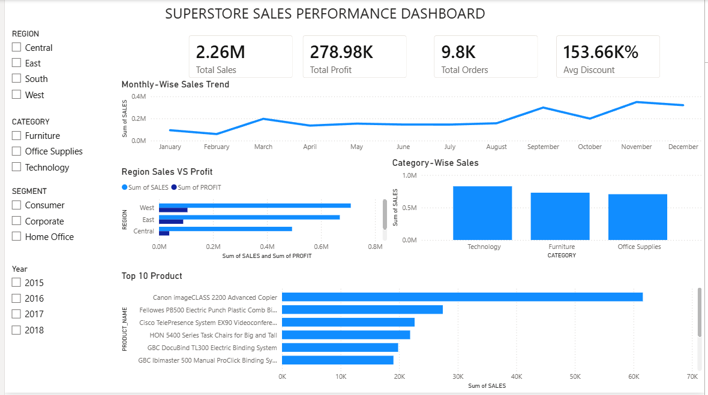

# Superstore-Sales-Analysis
End-to-End Sales Analysis using Excel, Oracle SQL and Power BI
# 📊 Superstore Sales Performance Dashboard

## 📌 Project Overview

This project analyzes Superstore sales data using Oracle SQL and Power BI. The objective is to identify sales trends, evaluate regional performance, analyze product categories, and build an interactive dashboard for business decision-making.

---

## 🛠️ Tools & Technologies

- Microsoft Excel
- Oracle SQL
- Microsoft Power BI
- GitHub

---

## 📂 Dataset

- Dataset: Superstore Sales Dataset
- Total Records: 9,800+
- Contains:
  - Customer Information
  - Product Details
  - Sales
  - Profit
  - Discount
  - Region
  - Order Date

---

## 📈 SQL Analysis Performed

The following analyses were performed using Oracle SQL:

- Total Sales
- Total Profit
- Total Orders
- Top 10 Products by Sales
- Region-wise Sales Analysis
- Region-wise Profit Analysis
- Category-wise Sales
- Category-wise Profit
- Monthly Sales Trend
- Profit Margin Calculation
- Average Discount Analysis

---

## 📊 Dashboard Features

The Power BI dashboard includes:

- KPI Cards
  - Total Sales
  - Total Profit
  - Total Orders
  - Average Discount

- Visualizations
  - Monthly Sales Trend
  - Region-wise Sales vs Profit
  - Category-wise Sales
  - Top 10 Products

- Interactive Slicers
  - Region
  - Category
  - Segment
  - Year

---

## 📸 Dashboard Preview



---

## 📁 Project Structure

```
Superstore-Sales-Analysis
│
├── README.md
├── dashboard.png
├── Superstore_Final.csv
├── final_projects1.sql
└── superstore_sale_dashboard.pbix
```

---

## 💡 Key Business Insights

- Technology category generated the highest sales.
- West region recorded the highest revenue.
- Monthly sales trends help identify seasonal demand.
- Top-selling products contribute significantly to overall revenue.
- Interactive filters enable dynamic business analysis.

---

## 👨‍💻 Author

Rahul Gandhi

Aspiring Data Analyst

Skills:
- SQL
- Power BI
- Excel
- Python
